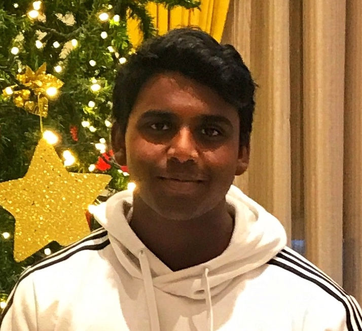

# Prashanth Rajan
## UCSD
### Computer Science

Currently taking **CSE** ~~220~~ *110*

Hello! My name is Prashanth Rajan.
I am from the Bay Area. I recently declared **Economics** as a second major after taking some econ classes as a breadth requirement. I play tennis for fun. I like solving coding problems (although I feel like I should spend a lot more time doing this). I am home at the moment but am really excited to come back to San Diego in Fall quarter. I hope I spend more time at the *beach* and ***learn to surf***

## Here is the photo I use for almost everything


## Hobbies

Below are some of my hobbies I will write about
* Tennis
* Disney
* Scripting

### Tennis

***I like to watch and play tennis***
**My favorite player is _Roger Federer_ from Switzerland**

### Disney
I love Disney movies
I like this Walt Disney quotation:
>The way to get started is to quit talking and begin doing.

### Bash Script

I like to use the `diff` command to double check my results with the expected results

Although I am not very good at it, I think bash script is fun
```
#!/bin/bash
echo "bash script is cool!"
```
## Some Languages I am familiar with
1. Java
2. C

## Some Languages I want to get familiar with
- [X] C
- [ ] Python
- [ ] Swift

## Social

Here is [my LinkedIn](https://www.linkedin.com/in/rajanprashanth/)

[Here's the readme](./README.md)


